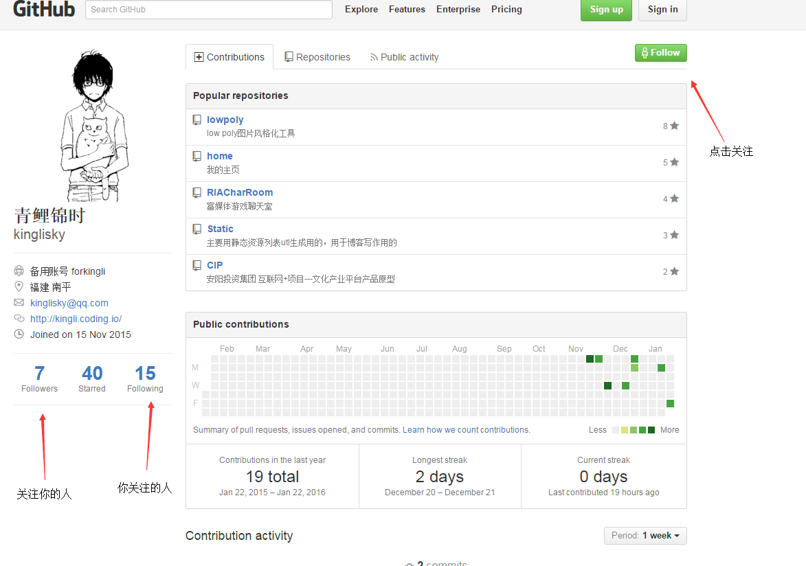

# orgDoc
信息技术实验室文档

越早开始使用github越好，以后就职会有很多加分项的，而且很适合代码分享与团队合作，发个简单教程，咱实验小伙伴可以相互帮助一下，以后好处大大滴有。

**1.关注与被关注**

小伙伴们可以相互关注一下，followers的数量可以某些程度上体现一个用户能力，挺重要的可以经营。

**2.star与fork**

你如果看到自己感觉很不错的项目，觉得好的话可以给他人点个星星，一方面可以标记喜欢的项目，方便日后找到使用。星星的数量某种程度上也体现这个项目的火热程度，需要经营。

fork表示类似拷贝到自己仓库，表示自己打算关注隔着项目，并有为项目做出贡献，比如常用的库可以fork一份到自己的库，也可以实时拉去更新，也是衡量一个项目的火热程度的指标。

**建议大家多相互关注，点星，觉得不错的可以fork一份**，在一个集体里经营github账号还是很简单的，不过这是只是一方面，更重要的充分利用好github提供的便利。 

**3.为私人的项目，多点些星星**

